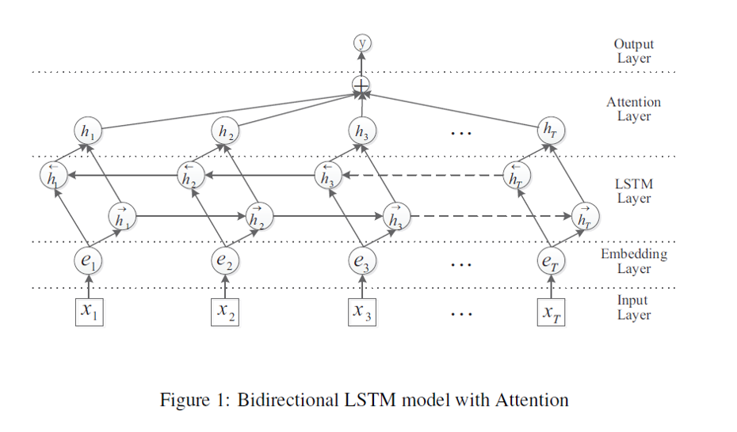

# Att_BLSTM
###  The code for paper 'Attention-Based Bidirectional Long Short-Term Memory Networks for Relation Classification   ACL  2016'

### 模型结构

### 项目环境配置
* Python3.8
* jupyter notebook
* torch            1.6.0+cu10.2
* numpy            1.18.5
* ConfigArgParse      1.5.2
* torchtext         0.7.0

### 数据集下载
* 执行 ·python reader.py·
